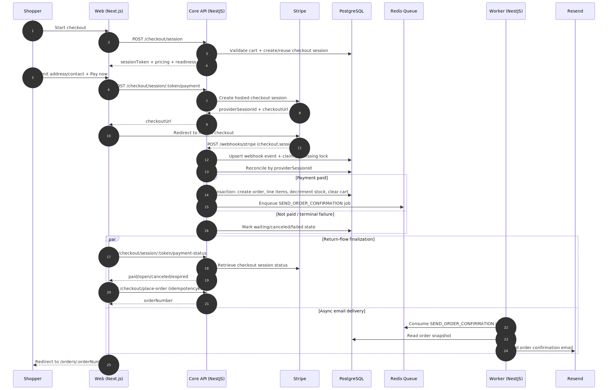
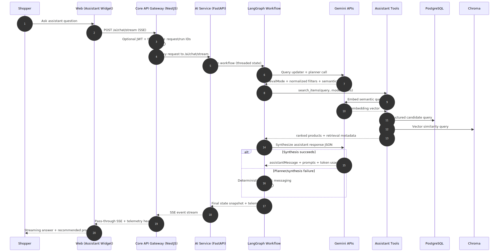

# ShopPilot Architecture Diagrams

This page is the recruiter-friendly view of the architecture diagrams.

## 1) System Context


Source: `01-system-context.mmd`

## 2) Runtime Containers


Source: `02-runtime-containers.mmd`

## 3) Checkout Sequence


Source: `03-checkout-sequence.mmd`

## 4) AI Assistant Sequence


Source: `04-ai-assistant-sequence.mmd`

## 5) ERD Lite


Source: `05-erd-lite.mmd`

## Regenerate SVGs
```bash
for f in "docs/architecture diagrams"/*.mmd; do
  npx -y @mermaid-js/mermaid-cli -i "$f" -o "${f%.mmd}.svg"
done
```
